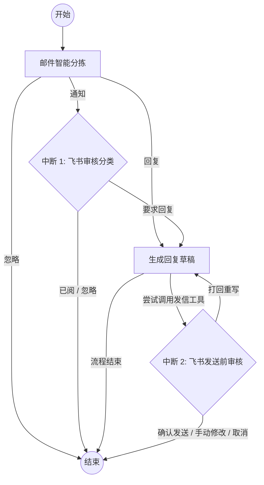

## 项目简介
本项目是一个基于 LangGraph 开发的智能邮箱助手，旨在通过 LLM 自动化处理 163 邮箱事务。系统集成了长期记忆管理与飞书推送功能，实现了从邮件分类、回复草拟到多端协同的全流程自动化。
## 核心功能
- 智能邮件处理：利用 LangGraph 构建工作流，自动识别邮件紧急程度与意图。
- 多工具调用 (Tools)：集成 163 邮箱底层协议，支持自动读取、搜索及撰写邮件。
- 长期记忆 (Memory)：通过 memory.py 实现用户偏好记忆，使 Agent 能够根据历史交互习惯生成更精准的回复。
- 人机回环控制 (Human-in-the-loop)：通过 LangGraph 的 interrupt 机制实现。在 Agent 执行高风险操作（如：发送正式回复邮件）前，系统会自动挂起并推送到飞书端等待人工审核，确保回复的准确性与合规性。
## 项目架构 
```text
├── agents/             # Agent 核心逻辑
│   ├── agent_prompt.py # 智能体提示词定义
│   ├── memory_prompt.py# 记忆提取相关的提示词
│   ├── tools.py        # LangGraph 使用的具体工具函数
│   └── tool_prompt.py  # 工具调用相关的提示词
├── core/               # 核心底层组件
│   ├── gp.py           # 图(Graph)定义或核心流程
│   ├── memory.py       # 长期/短期记忆管理
│   ├── models.py       # LLM 模型实例化配置
│   └── scheme.py       # 数据结构与 Schema 定义
├── feishu/             # 飞书集成模块
│   ├── feishu_tool.py  # 飞书 API 调用封装
│   └── run.py          # 飞书端的启动入口
├── utils/              # 通用工具类
│   ├── email_163.py    # 163 邮箱收发底层逻辑
│   └── helpers.py      # 辅助函数
└── requirements.txt    # 项目依赖清单
```
## Graph工作流 (Workflow)



